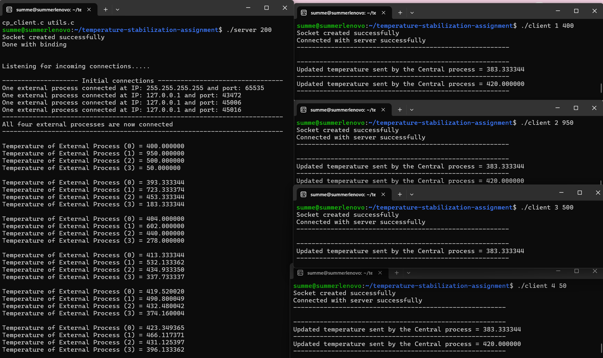
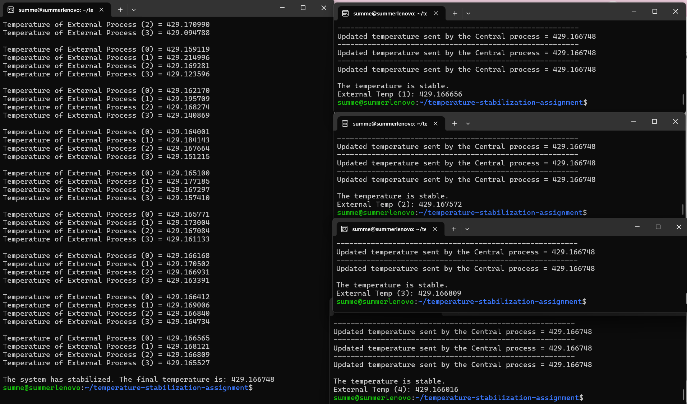

# Temperature stabilization using inter-process communication

## Decription
The assignment is the implementation of a basic client-server program of a temperature-stabilization system. The server and four client processes contain loops that facilitate their communication. The server starts with an initial temperature, receives the initial temperatures from the clients, and uses the formula below to update its central temperature.

**Central process:**

$$
\text{centralTemp} \longleftarrow \left(2 \cdot \text{centralTemp} + \sum_{i=1}^4 \text{externalTemp}_i \right) / 6
$$

The results of the central temperature calculation are then sent to each client which uses the equation below to update its own temperature.

**External processes:**

$$
\text{externalTemp} \longleftarrow \left(3 \cdot \text{externalTemp} + 2\cdot \text{centralTemp} \right) / 5
$$

The results of each external temperature are sent back to the server where the process repeats until the stability check is satisfied. To check if the temperature is stable, the server verifies if each current external temperature is less than 0.001 degrees different than the previous value. Once the server determines the system is stable, it sends -1 back to each client to indicate they can print their final values and terminate.

## Execution
The test featured in the screenshots at the bottom utilized the following values.     

```shell
./server 200
```

```shell
./client 1 400
```

```shell
./client 2 950
```

```shell
./client 3 500
```

```shell
./client 4 50
```

### Start of Execution


### End of Execution

